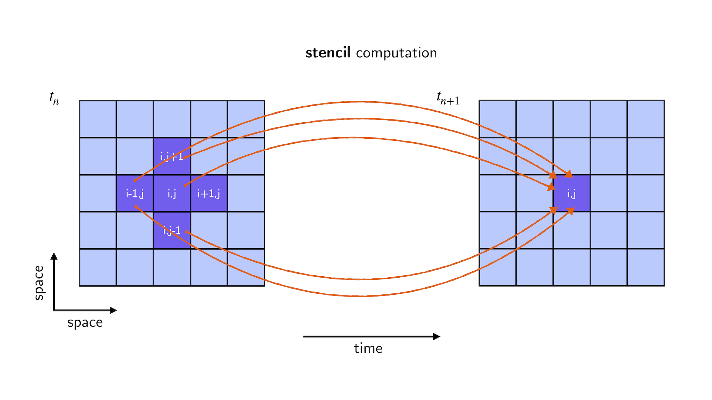
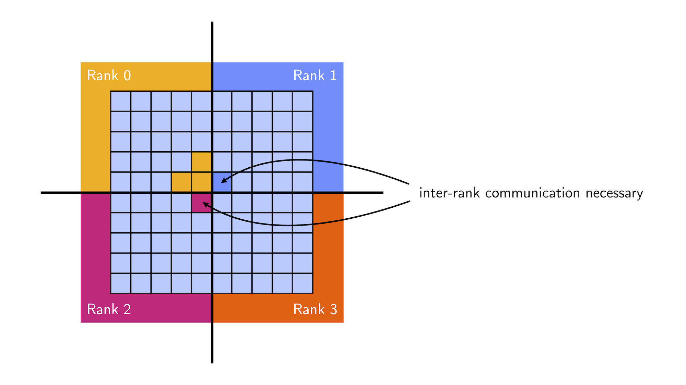
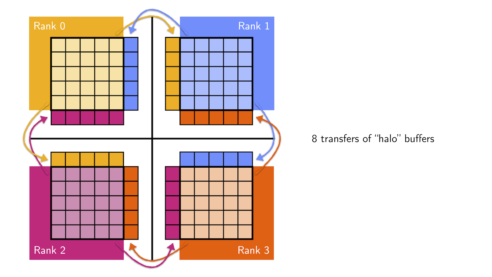

# Exercise: Diffusion 2D - MPI

The goal of this exercise is to take our 2D linear diffusion solver and parallelize it with MPI such that it can be scaled across multiple compute nodes (or simply different cores within a single node). To this end, we need to touch upon a few conceptual things before moving to the exercise tasks.

## Setup for MPI parallelization

### Strong scaling → weak scaling

Typically, MPI applications are supposed to work at scale and, ideally, use all the available distributed resources. A **strong scaling approach** - where the total problem size is fixed - doesn't always work well for this. For example, if the number of MPI ranks to be used is increased, there may not be enough work left for all of them at some point.

For these reasons, we switch to a **weak scaling approach**, where the **problem size per worker is fixed** and the overall problem size increases with increasing parallel resources. If `ns` previously indicated the linear length of the entire computational grid, it will now indicate the linear length of the computational grid per worker.

### Communication (no shared memory)

Unlike threads, MPI ranks don't share memory and will thus need to communicate to work together collectively. Let's take a look at what communcation is necessary in our 2D diffusion solver.

#### Stencil

When updating a point `i,j` of our grid in our diffusion kernel (`diffusion_step!` function) we need information from a cross-like region around this point:

The reason for this shape is that we use finite differences to compute second order derivatives, i.e.

${\displaystyle f''(x) \approx {\frac {{\frac {f(x+ds)-f(x)}{ds}}-{\frac {f(x)-f(x-ds)}{ds}}}{ds}}={\frac {f(x+ds)-2f(x)+f(x-ds)}{ds^{2}}}.}$

which requires the knowledge of `f` at three positions. The same holds for the y-dimension which is why we get a cross.

#### Local grids

What does the cross-shape tell us about communication? Let's look at the overall MPI setup, where each MPI rank holds a local part of a global grid. Furthermore, let's consider the case where we try to update the grid point at the bottom right corner of the first MPI rank's local grid:

Clearly, for the MPI rank to perform the diffusion step, it needs to know values from it's neighbors which requires communication. What the cross-shape tells us is that the MPI rank will only ever need values from neighbors when updating the first/last column/row of it's local grid and that it only needs values from their respective first/last column/row.

#### "Halos"

To enable the necessary communication, we introduce buffers for sending and receiving data on each rank. We further artifically increase the size of each rank's local grid by one in all directions. The idea is to copy the received values into these "halo" columns/rows such that our computational kernel (`diffusion_step!`) can treat all "physical" grid points identically.

For the case of a 2x2 grid of 4 MPI ranks, we visualize this setup like this:

(For each rank, the thick black border encloses the "physical" grid points. The rows/columns outside of this part are the "halos" from neighboring ranks.)

In this case, each MPI rank has precisely two neighbors leading to an exchange of 8 "halos" in total: each rank needs to send twice and receives twice.

If we increase the number of MPI ranks, there will be more communication necessary. Trivially, because there are simply more MPI ranks. But also because there will be MPI ranks that have more than two neighbors. One thing is for certain though: an MPI rank will never have more than four neighbors and thus never has to send/receive more than four times.

#### Visualization

Previously, the single Julia process that ran the diffusion computation rendered visualizations on-the-fly and saved them to disk. With MPI, that's not directly possible anymore because non of the ranks has the full picture.

To circumvent this, in this exercise, we dump each MPI rank's result to disk (`out_i.jld2`) and combine and visualize the results afterwards (with the script `visualize_mpi.jl`).

## Exercise Tasks

With this MPI setup in mind, let's move on to the exercise tasks and coding.

## Task 1: Halo exchange

1. Inspect the file `diffusion_2d_mpi.jl` and try to understand the general structure.
2. Before changing anything, run the file using 4 MPI ranks (`mpiexecjl -n 4 julia --project diffusion_2d_mpi.jl`) and then visualize the (wrong) results (`julia --project visualize_mpi.jl`).
3. Implement the halo exchange in the function `update_halo!` by using non-blocking communication (`Irecv!`, `Isend`). See the `TODO` block in the file for more information.
4. Run the code again, visualize the result again, and check that the code is correct (you should see very clearly if it's not correct 😉).

## Task 2: Benchmark

TODO...